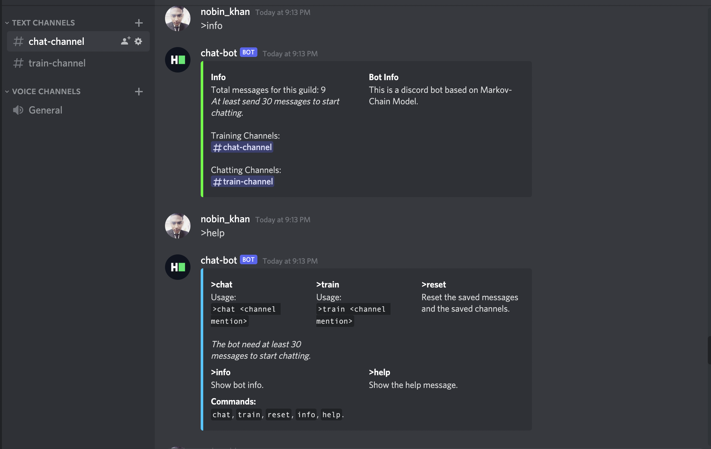

# d-markov-chatbot 🪄

A discord bot that generates and sends messages based on Markov Chain Model.

## Implementation

- Implement **Markov Chain Model** to generate text messages.
- Utilize **queue** data-structure to create Markov Chain.
- Utilize **SQL async io operations** using *aiosqlite*.

---

[](d-markov-chatbot)

## Pre-requisites

- [Python >=3](https://www.python.org/)
- [disnake>=2.3.0](https://github.com/DisnakeDev/disnake)
- [aiosqlite>=0.17.0](https://github.com/omnilib/aiosqlite)

## Setup

- Clone the repository

    ```bash
    git clone https://github.com/m-nobinur/d-markov-chatbot.git
    ```

- Setup an app on discord, [instructions.](https://github.com/reactiflux/discord-irc/wiki/Creating-a-discord-bot-&-getting-a-token)
- Get the bot token<YOUR_BOT_TOKEN>.
- Invite your bot using following link:
  <https://discord.com/oauth2/authorize?&client_id=APPLICATION_ID&scope=bot+applications.commands&permissions=PERMISSIONS_INT>
  > Replace `APPLICATION_ID` with the application ID and replace `PERMISSIONS_INT` with the required permissions integer

- Either set BOT_USER_TOKEN=YOUR_BOT_TOKEN in quote-bot.py or use the token as argument when run the script.

## How to start

Open terminal and go to `d-markov-chatbot` folder.

```bash
cd d-markov-chatbot
```

Install all the requirements

```bash
pip install -r requirements.txt
```

or

```bash
pip3 install -r requirements.txt
```

<br>

### Run your bot

Set `BOT_TOKEN` variable to <YOUR_BOT_TOKEN> & set a `BOT_PREFIX`  then run the script as following (On Mac/Linux)

```bash
python3 chat-bot.py
```

(On Windows)

```bash
python chat-bot.py
```

> ℹ️
> Use virtual environment for best practices.

## Available command

| Variable                  | What it is                                                            |
| ------------------------- | ----------------------------------------------------------------------|
| >info                        | Show bot & channels info.
| >help     | Show available commands and their usages.                                            |
| >chat <channel_mention>    | Add the mentioned channel to Chatting channel list.                                            |
| >train <channel_mention>        | Add the mentioned channel to Training channel list.
| >reset  | Reset the whole database.                                        |

> Bot will start messaging in chat channel when user will send a message.
> Make sure there at least 30 messages sent in the traning channels.
